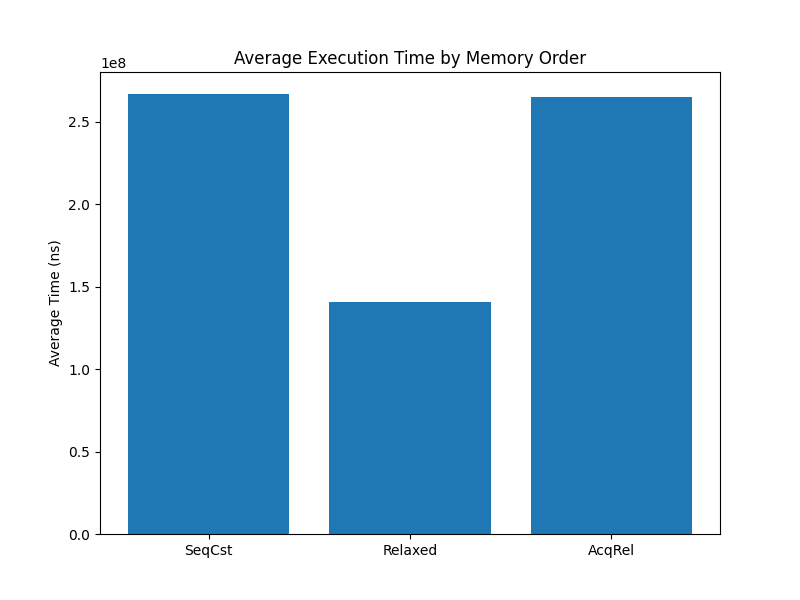
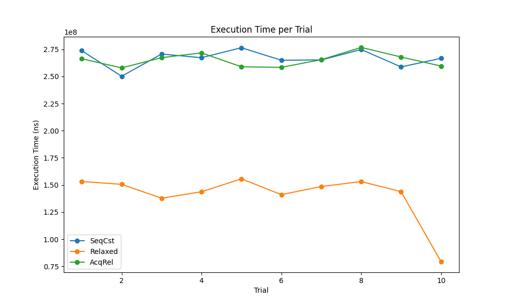

# Memory Order Benchmarking Project

This project demonstrates how different memory orderings affect both the **correctness** and **performance** of concurrent operations using C++11 atomics. By implementing a shared counter that is incremented by multiple threads, we explore several memory orders:
- **Sequentially Consistent (seq_cst)**
- **Relaxed**
- **Acquire–Release (acq_rel)**

Additionally, the project leverages the [Kaizen library](https://github.com/heinsaar/kaizen) for command-line argument parsing and timing, writes detailed trial results to a CSV file, and includes a Python script for visualizing and analyzing the performance data.

---

## Table of Contents

- [Overview](#overview)
- [Features](#features)
- [Project Structure](#project-structure)
- [Requirements](#requirements)
- [Building the Project](#building-the-project)
- [Running the Tests](#running-the-tests)
- [Visualization](#visualization)
- [Sample Results](#sample-results)
- [Memory Orders in C++](#memory-orders-in-c)
- [License](#license)
- [Acknowledgments](#acknowledgments)

---

## Overview

This project is designed to illustrate the importance of **well-defined memory operations** in concurrent programming. It provides multiple implementations of a shared atomic counter using:
- `std::memory_order_seq_cst`
- `std::memory_order_relaxed`
- `std::memory_order_acq_rel`

A test harness measures the execution time of each implementation over multiple trials. The results are then output in a CSV file for further statistical analysis and visualization.

---

## Features

- **Multiple Memory Orders:** Compare performance and correctness using different memory ordering constraints.
- **Multi-threading:** Spawns several threads to perform atomic increments concurrently.
- **Command-Line Parsing:** Uses the Kaizen library for flexible argument parsing.
- **Timing and Analysis:** Measures execution time in nanoseconds, calculates averages, and exports results to CSV.
- **Data Visualization:** A Python script (`visualization.py`) processes CSV data to generate bar and line charts.
- **Makefile:** Easily build the project with a single `make` command.

---

## Requirements

- **C++ Compiler:** A C++17 compliant compiler (e.g., g++ or clang++).
- **POSIX Threads:** Ensure your system supports pthreads (most Unix-like systems do).
- **Kaizen Library:** The project assumes `kaizen.h` is available in your include path. If not, download it from the [Kaizen repository](https://github.com/heinsaar/kaizen) and place it in your project directory or appropriate include folder.
- **Python:** Python 3.x is required for the visualization script.
- **Python Packages:** `pandas` and `matplotlib` for data visualization. Install via pip:
  ```bash
  pip install pandas matplotlib
  ```

---

## Building the Project

A Makefile is provided for easy compilation. In the project root directory, run:

```bash
make
```

This will compile all source files and generate an executable called `counter_test`.

---

## Running the Tests

Run the executable with the required command-line arguments:

```bash
./counter_test --iterations <iterations> --trials <trials> [--threads <threads>] [--verbose]
```

- `--iterations <iterations>`: Number of increments per thread.
- `--trials <trials>`: Number of times to repeat the tests.
- `--threads <threads>`: (Optional) Number of threads to spawn (default is 8).
- `--verbose`: (Optional) Print detailed trial results.

Example:

```bash
./counter_test --iterations 1000000 --trials 10 --threads 8 --verbose
```

The program will output final counter values for each memory order, performance statistics, and will generate a `results.csv` file with detailed trial data.

---

## Output example

Below is a sample output from a test run:

```yaml
Final counter values (expected 8000000):
  seq_cst: 8000000
  relaxed: 8000000
  acq_rel: 8000000

| SeqCst operations avg (ns)          |    266827599 |
| Relaxed operations avg (ns)         |    140699449 |
| AcqRel operations avg (ns)          |    264968795 |
| Speedup (seq_cst / relaxed)         |         1.90 |
| Speedup (seq_cst / acq_rel)         |         1.01 |

Trial Results:
Trial 1: SeqCst = 273700000 ns, Relaxed = 153182542 ns, AcqRel = 266270334 ns
Trial 2: SeqCst = 250118916 ns, Relaxed = 150589250 ns, AcqRel = 257822625 ns
Trial 3: SeqCst = 270594542 ns, Relaxed = 137834334 ns, AcqRel = 267261000 ns
Trial 4: SeqCst = 267216917 ns, Relaxed = 143716583 ns, AcqRel = 271663417 ns
Trial 5: SeqCst = 276415166 ns, Relaxed = 155661791 ns, AcqRel = 258847542 ns
Trial 6: SeqCst = 264912875 ns, Relaxed = 141099708 ns, AcqRel = 258372125 ns
Trial 7: SeqCst = 265168708 ns, Relaxed = 148543083 ns, AcqRel = 265375875 ns
Trial 8: SeqCst = 274751042 ns, Relaxed = 153165458 ns, AcqRel = 276676875 ns
Trial 9: SeqCst = 258744750 ns, Relaxed = 143819208 ns, AcqRel = 267870791 ns
Trial 10: SeqCst = 266653083 ns, Relaxed = 79382542 ns, AcqRel = 259527375 ns
```

Explanation:

Final Counter Values: All memory order implementations produce the expected counter value of 8,000,000 (for 8 threads × 1,000,000 iterations).

Average Times: The table shows the average execution time in nanoseconds for each memory order. Notice how the relaxed version is the fastest.

Speedups: The speedup ratios compare seq_cst with relaxed and acq_rel, showing performance differences.

Trial Results: Detailed per-trial timings provide insight into performance consistency across multiple test runs.

## Visualization

After running the tests, you can visualize the performance data with the provided Python script:

```bash
python3 visualization.py
```

This script will:
- Read `results.csv`
- Generate a bar chart showing average execution times for each memory order
- Generate a line chart of execution times across individual trials

Charts are saved as `average_times.png` and `trial_times.png` and are also displayed.

---

## Sample Results

Below are two sample images that might be produced by `visualization.py`. These reflect hypothetical performance outcomes when running 10 trials, each with 1,000,000 increments across 8 threads:

### 1. Average Execution Time by Memory Order



**Interpretation**:  
- **SeqCst** shows the highest time, reflecting its stronger ordering constraints.  
- **Relaxed** is much faster, as it imposes minimal synchronization.  
- **AcqRel** lies somewhere in between, offering partial ordering guarantees.

### 2. Execution Time per Trial



**Interpretation**:  
- This chart displays how the three memory orders perform across each of the 10 trials.  
- We can see **Relaxed** remains consistently lower than **SeqCst** and **AcqRel**.  
- **SeqCst** and **AcqRel** might fluctuate slightly from trial to trial, but maintain higher latency overall compared to **Relaxed**.

---

## Memory Orders in C++

Below is a quick summary of the memory orders used in this project:

- **`std::memory_order_seq_cst`:**  
  The default, strongest ordering; enforces a single global order of operations.

- **`std::memory_order_relaxed`:**  
  Minimal synchronization; only atomicity is guaranteed, no ordering.

- **`std::memory_order_acq_rel`:**  
  Combines acquire and release semantics; ideal for read-modify-write operations.

Each memory order affects the synchronization and performance of atomic operations. This project provides a practical demonstration of these differences.

---

## License

This project is released under the MIT License. See the [LICENSE](LICENSE) file for details.

---

## Acknowledgments

- The [Kaizen library](https://github.com/heinsaar/kaizen) for providing a simple command-line parsing solution.
- The C++ standards committee for introducing powerful atomic operations that make concurrent programming more robust and efficient.
---

Happy coding and benchmarking!
